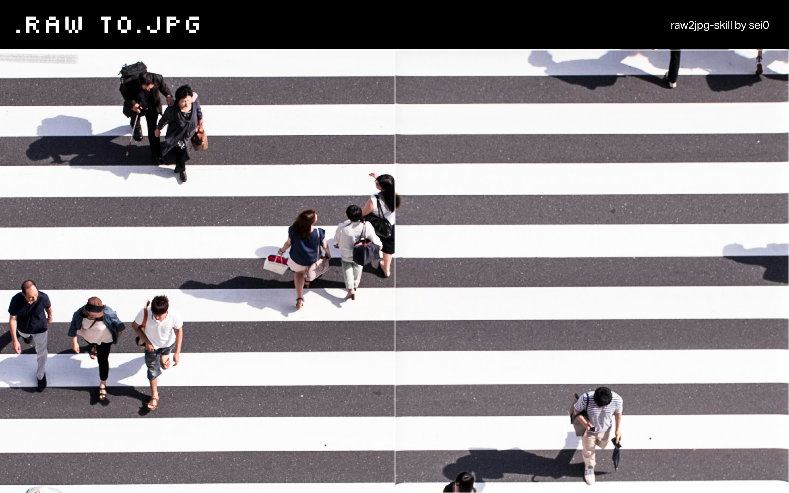

# raw2jpg



Batch convert camera RAW files to JPEG from the command line, with quality and resize controls.

Supports 17 RAW formats from major camera manufacturers including Sony (ARW), Canon (CR2/CR3), Nikon (NEF), Fujifilm (RAF), and more. Uses system-native `sips` on macOS or `dcraw` on Linux/Windows — no extra setup needed on Mac.

[](https://skillpad.dev/install/sei0/raw2jpg/raw2jpg)

## Quick Start

```bash
npx raw2jpg ./photos --size 2k
```

Or install globally if you prefer:

```bash
npm install -g raw2jpg
```

## Usage

```
npx raw2jpg [options] <input>
```

### Options

| Option | Description | Default |
|---|---|---|
| `-o, --output <dir>` | Output directory | `./jpg_output` |
| `-q, --quality <n>` | JPEG quality 1-100 | `90` |
| `-s, --size <preset>` | Size preset: `original` `4k` `2k` `hd` `fhd` | `original` |
| `-w, --width <n>` | Max width in px (keeps aspect ratio) | — |
| `--height <n>` | Max height in px (keeps aspect ratio) | — |
| `-c, --concurrency <n>` | Files to convert in parallel | CPU cores |
| `--overwrite` | Overwrite existing files | `false` |
| `--dry-run` | Preview without writing files | `false` |
| `-v, --verbose` | Verbose output | `false` |

### Examples

```bash
# Convert all RAW files in a directory
npx raw2jpg ./photos

# Resize to 2K with 85% quality
npx raw2jpg ./photos --size 2k -q 85

# Custom output directory
npx raw2jpg ./photos -o ./exports

# Preview what would be converted
npx raw2jpg ./photos --dry-run

# Convert with 4 parallel workers
npx raw2jpg ./photos -c 4
```

Output:

```
Converting [==========] 113/113 | DSC05840.ARW | ETA: 0s

✓ Conversion complete!

  Files converted:  113
  Total input size: 2.6 GB
  Total output size: 50 MB
  Compression ratio: 98%
  Output directory:  /Users/user/photos/jpg_output
```

## Supported Formats

| Extension | Manufacturer |
|---|---|
| `.arw` | Sony |
| `.cr2` `.cr3` | Canon |
| `.nef` `.nrw` | Nikon |
| `.raf` | Fujifilm |
| `.orf` | Olympus / OM System |
| `.rw2` | Panasonic |
| `.pef` | Pentax |
| `.srw` | Samsung |
| `.dng` | Adobe DNG |
| `.3fr` | Hasselblad |
| `.kdc` `.dcr` | Kodak |
| `.erf` | Epson |
| `.rwl` | Leica |
| `.raw` | Generic |

## Notes

- **macOS**: Uses built-in `sips` — no additional installation required.
- **Linux/Windows**: Requires [`dcraw`](https://www.dechifro.org/dcraw/). Install via `apt install dcraw` or `brew install dcraw`.
- Size presets (`--size`) and explicit dimensions (`--width`/`--height`) cannot be combined.
- Failed files are skipped and reported at the end; the rest of the batch continues.

## License

MIT
